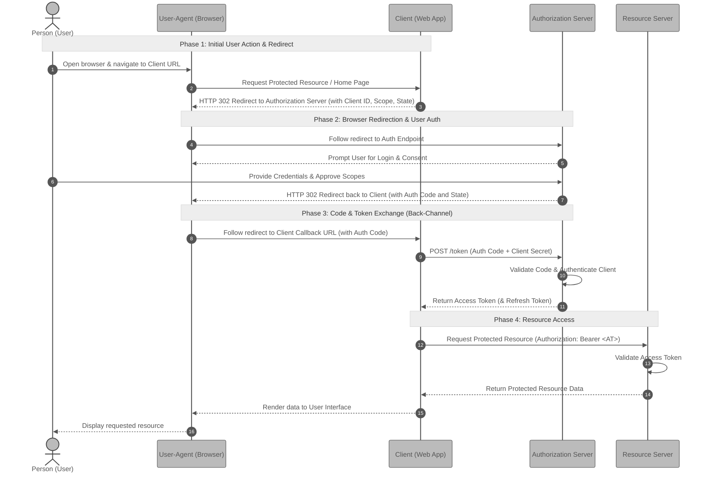

# Part IV — OAuth 2.0 and OpenID Connect: Letting Someone Act for You

The first three parts of this series answered one question: _who are you?_ This final part answers a harder one: _how do you let an app act on your behalf without ever handing it your password?_ **OAuth 2.0**is the framework that solves that problem — delegated, limited access — and **OpenID Connect** is the thin layer added on top that turns it into a way to log in. Together they are the quiet machinery behind nearly every "Connect your account" and "Sign in with…" button on the internet.

## Where We've Been, and the Question That's Left

This series has been a steady climb. **[Part I](https://dev.to/eugene-zimin/practical-guide-to-api-authentication-part-i-basic-authentication-4ndn)** sent a username and password with every request. **[Part II](https://dev.to/eugene-zimin/api-authentication-part-ii-api-keys-2l51)** replaced that reusable password with an API key — one opaque secret string standing in for an application. **[Part III](https://dev.to/eugene-zimin/api-authentication-part-iii-jwt-tokens-3c6a)** made the credential self-describing: a JWT that carries its own identity and permissions, stamped so it can't be forged.

Three different credentials, three different trade-offs. But underneath, all three answered the _same single question_:

> **"Who are you?"**

They are mechanisms of **authentication** — proving identity. And every one of them quietly assumes the same thing: that the party holding the credential is its rightful owner, acting _for itself_.

When you let a photo-printing website reach into your Google Photos, or allow a budgeting app to read your bank transactions, or click "Sign in with GitHub" on a site that is not GitHub — something more delicate is happening. You are not proving _your own_ identity to a service. You are granting _a different company_ permission to touch _your_ data, held by _yet another_ company. Three parties, not two. And you would never dream of solving it the obvious way — by handing the middleman your password.

![[Delegated Access - The Three-Party Problem.png]]Figure 1. Delegated Access - The Three-Party Problem

That problem — **how to grant a third party limited access to your resources without sharing your credentials** — is the subject of this article. It is the problem of **authorization** and **delegation**, and the answer is a framework called **OAuth 2.0**.

## The Problem: The Password Anti-Pattern

Before meeting the solution, it's worth feeling the full weight of the problem. The clearest way to do that is to try the naive approach and watch it fail.

### A concrete scenario

Imagine a service called **PrintMyPics**. It does one thing: it takes your digital photos, prints them on glossy paper, and mails them to you. To do its job, PrintMyPics needs to _read the photos_ you keep in your **CloudVault** account — a cloud storage service from an entirely different company.

You are happy for PrintMyPics to see your photos. So how does CloudVault let it in?

### The obvious "solution" — and why it's a disaster

The obvious idea is the one a beginner reaches for instinctively: **just give PrintMyPics your CloudVault username and password.** It logs in as you, downloads the photos, done.

This is so common mistake that security engineers have a name for it — the **password anti-pattern**. An _anti-pattern_ is a solution that looks reasonable, gets used often, and is quietly wrong. This one is wrong in at least four distinct ways, and they are worth separating out, because OAuth was designed to fix each of them in turn.

**1. It grants _total_ access, not the access you meant.** You wanted PrintMyPics to _read your photos_. But your CloudVault password doesn't unlock "the photos" — it unlocks _your entire account_. The same password that reads photos can also delete files, read your private documents, change your account settings, and lock you out. There is no way to hand over a _slice_ of your account. The password is all-or-nothing.

> A password is a master key to the whole building. You wanted to lend someone the key to one room.

**2. The third party now _stores your password_.** For PrintMyPics to log in as you whenever it needs to, it must _keep_your password — saved in its database, sitting on its servers. You have now multiplied your risk. Your CloudVault account is only as safe as PrintMyPics' security, and you know nothing about PrintMyPics' security. If they are breached, your password leaks — and because people reuse passwords, possibly far more than your CloudVault account leaks with it.

**3. You cannot revoke PrintMyPics without breaking everything else.** Suppose you change your mind and want to cut PrintMyPics off. Your only lever is to _change your CloudVault password_. That does lock out PrintMyPics — but it also logs out **you**, on every device, and breaks **every other app** you had connected the same way. There is no "disconnect just this one service" switch, because from CloudVault's point of view, PrintMyPics _was_ you. It never knew there was a third party at all.

**4. It breaks completely under two-factor authentication.** Many accounts now require a second step at login — a code from your phone, a tap on an authenticator app. That step exists precisely to stop an automated system from logging in with just a password. PrintMyPics, logging in as you, hits that wall every time. The anti-pattern doesn't just have weak security; it is fundamentally incompatible with _good_ security.

### What the failure tells us

Step back and look at _why_ every one of those four failures happened. They all trace to a single root cause:

> The password is a credential built to answer **"are you the account owner?"** — a yes-or-no question. It carries no notion of _who is asking_, _what they want to do_, or _for how long_.

![[Total Access Delegation Trap.png]]Figure 2. Total Access Delegation vs. Scoped Delegation

To safely let PrintMyPics in, CloudVault would need a credential that can express things a password simply cannot:

- **Who** is being granted access — _PrintMyPics specifically_, recognised as a distinct third party, not impersonating you.
- **What** they may do — _read photos_, and nothing else. A narrow slice, not the master key.
- **For how long** — an access that _expires_, and that you can switch off on its own without disturbing anything else.

A password expresses none of these. What's needed is a different kind of credential entirely — one issued _to the third party_, _scoped_ to a specific permission, _time-limited_, and _individually revocable_. And, crucially, obtained through a process where **your password is shown only to CloudVault, and never once to PrintMyPics.**

That credential is called an **access token**, and the carefully choreographed process that issues it is **[OAuth 2.0](https://datatracker.ietf.org/doc/html/rfc6749)**. To follow how that choreography works, we first need to meet its cast of characters — the four roles every OAuth interaction is built from.

## The Cast: The Four Roles of OAuth

OAuth can feel intimidating, but most of that difficulty is vocabulary. The protocol has exactly **four roles**, and once you can name them and tell them apart, the rest of OAuth is mostly watching those four pass messages around. Almost every confusion about OAuth is really a confusion about which role is doing what.

So we'll spend a moment getting them straight, anchored to the PrintMyPics scenario from the previous section.

### The four roles

**1. The Resource Owner — you.** The Resource Owner is whoever owns the data and has the right to grant access to it. In our scenario, that's **you**: the photos in CloudVault are yours, so you alone can decide whether PrintMyPics may see them. The name is precise — you _own_ the _resource_.

**2. The Client — the app that wants in.** The Client is the application requesting access to your data. Here, that's **PrintMyPics**. Note the word carefully: in OAuth, "client" does _not_ mean _you_ or your browser — it means the _third-party application_ asking to act on your behalf. This is the single most common naming mix-up in OAuth, so it's worth fixing now: **the Client is the company that wants something.**

**3. The Resource Server — where your the data lives.** The Resource Server is the system that actually holds your data and answers requests for it. In our scenario, that's the part of **CloudVault** that stores and serves photos. When PrintMyPics finally downloads your pictures, the Resource Server is what hands them over — but only when shown a valid access token.

**4. The Authorization Server — the gatekeeper.** The Authorization Server is the system that knows _you_, checks your password, asks for your consent, and — if all is well — issues the access token. This is also part of **CloudVault**, but it's worth thinking of as a separate desk: its job is not to store photos but to _verify identity and grant permission_.

![[The Four Roles of OAuth.png]]Figure 3. The Four Roles of OAuth

Splitting CloudVault into two roles — a **Resource Server** that holds data and an **Authorization Server** that grants access — is not pedantry. It is the central design move of OAuth, and the reason will become clear shortly: the part that _checks your password_ and the part that _serves your files_ are deliberately kept separate, so your password only ever has to be shown to one of them.

### An analogy: the hotel front desk

The four roles map cleanly onto something everyone has experienced — checking into a hotel.

Here is the whole protocol in miniature. A visitor (the Client) wants into your room. They do **not** get your identity or your credit card — instead, _you_ go to the **front desk** (the Authorization Server), prove who you are, and authorise a **key card** for that specific visitor. The front desk issues a key card scoped to one room, set to stop working at checkout. The visitor then walks to your **door** (the Resource Server), and the lock simply checks the card. The door never sees your ID; it only trusts cards the front desk issued.

That key card is the **access token**. Notice the properties it has, and that a copy of your house key would not:

- It is **specific** — it opens one room, not the whole hotel.
- It is **time-limited** — it stops working at checkout, automatically.
- It is **revocable** — the desk can deactivate this one card without touching anyone else's.
- It **reveals nothing about you** — the visitor never learns your password, your identity, or your payment details.

Those four properties are exactly the four failures of the password anti-pattern from Section 1, turned around. The whole point of OAuth is to issue a credential that behaves like a hotel key card instead of a master key.

![[The Hotel Analogy - Mapping Auth Roles and Tokens.png]]Figure 3. The four roles of OAuth, and the hotel front-desk analogy

### A note on the access token

You've now met the access token twice — as the key card here, and as the scoped, time-limited credential at the end of the previous section. It's worth stating plainly what it is, because readers of [Part III](https://dev.to/eugene-zimin/api-authentication-part-iii-jwt-tokens-3c6a) will recognise it.

An **access token** is a string the Client attaches to each request it makes to the Resource Server, exactly the way an API key was attached in Part II. It is, in OAuth's terms, a **bearer token** — whoever bears it can use it, a property we examined at length with JWTs. Often the access token _is_ a JWT, carrying scopes and an expiry inside itself for stateless verification; sometimes it's an opaque reference string the Resource Server looks up for. OAuth in this case deliberately doesn't mandate which. What OAuth _does_ define is not the token's format but the **process** — the careful sequence by which that token gets issued to the right Client, with your consent, without your password ever reaching the wrong hands.

![[The Access Token and Bearer Token Concepts.png]]Figure 4. The Access Token and Bearer Token Concepts

That process has a name: the **Authorization Code flow**. With the four roles in hand, we can finally walk through it step by step.

## Scopes and Consent: The Part You Actually See

The four roles and the access token are the machinery of OAuth. But there are two ideas a Resource Owner _experiences directly_ every time they connect an app — and getting them clear makes the upcoming flow walkthrough far easier to follow. They are **scopes** and the **consent screen**.

### Scopes: access in slices

Back in previous sections, the second thing a password couldn't express was **what** a third party may do or permission set. It was just all-or-nothing. **Scopes** are OAuth's answer to that.

A **scope** is a label naming one specific, limited permission. Instead of "access to your account," the Client asks for a precise slice — and only that slice. They are just short strings, defined by whoever runs the Authorization Server. CloudVault might offer scopes like:

```
photos:read      — view photos
photos:write     — upload or modify photos
files:read       — view all files
account:delete   — delete the account
```

When PrintMyPics begins an OAuth flow, it doesn't ask for "access." It names the _exact_ scopes it needs — and a well-behaved Client asks for as few as possible. PrintMyPics prints photos, so it requests:

```
scope=photos:read
```

That's the whole request. Not `photos:write`, not `files:read`, and certainly not `account:delete`. The access token CloudVault eventually issues will be stamped with `photos:read` and nothing more. If PrintMyPics later tries to _upload_ a photo or _delete_ a file with that token, the Resource Server checks the scope, sees the permission isn't there, and refuses.

> A scope turns the master key into a key card cut for one door. The Client doesn't get "access" — it gets _exactly the access it named, and no more._

This principle — request the narrowest permission that does the job — is called **least privilege**, and it's one of the oldest ideas in security. Scopes are how OAuth makes it routine. They also make the next idea — consent — meaningful, because they give you something _specific_ to consent to.

### The consent screen: where delegation actually happens

Everyone has seen a consent screen, even if they never knew its name. It's the page that appears the moment you click "Connect to CloudVault" on the PrintMyPics website — a page that looks something like this:

![[The Concent Window.png]]Figure 5. The consent screen — where the Resource Owner grants scoped access on the Authorization Server's own page

This unremarkable little page is, in fact, the **single most important moment in all of OAuth**. It is the instant delegation actually happens — the point where you, the Resource Owner, look at exactly what is being asked and make a decision. Three things are worth noticing about it, because each one is a quiet fix for a flaw from Section 1.

**It is served by the Authorization Server, not the Client.** Look at the top of the box: it says _CloudVault_, not _PrintMyPics_. This page is shown by CloudVault, on CloudVault's own domain. That matters enormously — it means you type your CloudVault password (if you aren't already logged in) into _CloudVault's_ page, never into anything PrintMyPics controls. **PrintMyPics never sees your password.** That is the password anti-pattern's central flaw, designed out of existence.

**It states the scopes in plain language.** "View your photos" is the scope `photos:read`, translated for a human. The screen is your chance to see the _exact_ slice of access being requested — and to notice if an app is overreaching. If a photo-printing service's consent screen asked to _delete your account_, that screen is where you'd catch it and click Cancel.

**Consent is yours to give, and yours to withdraw.** Clicking "Allow" is what authorises the whole flow; clicking "Cancel" ends it with nothing granted. And because this grant is recorded by the Authorization Server as its own distinct thing, you can later go to CloudVault's settings, find "PrintMyPics" in a list of connected apps, and revoke _just that one_ — without changing your password, without disturbing any other app. That's the third password-anti-pattern failure solved: revocation that is surgical instead of scorched-earth.

### What we have so far

We now have all the pieces _except the sequence_:

- **Four roles** — Resource Owner, Client, Authorization Server, Resource Server.
- **Scopes** — the named slices of access a Client requests.
- **Consent** — the Resource Owner approving those scopes, on the Authorization Server's own page, password never exposed.
- **The access token** — the scoped, time-limited key card the flow ultimately produces.

What remains is to see _how they move_ — the exact order of redirects and exchanges that carries you from clicking "Connect" to PrintMyPics holding a valid token. That ordered sequence is the **Authorization Code flow**, and it is the heart of OAuth. We turn to it next.


