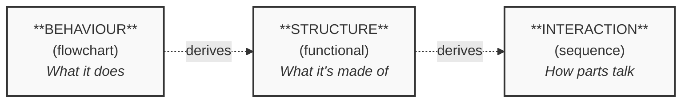

# From Idea to Blueprint: Turning a Vague App Concept into Something You Can Actually Build

# Lesson 1 of _Build a Twitter Clone_ — A Practical Guide to Software Modelling

"Build a Twitter clone" is a wish, not a plan — you can't write code from a single sentence. This lesson shows you how to think about turning a fuzzy app idea into a concrete blueprint: we scope a deliberately small messaging app called `Bird`, then introduce the three-lens model — _what should it do?_, _what parts must exist?_, and _how do those parts talk to each other?_ — that the rest of the series uses to actually draw it. By the end you'll have a bounded project and a clear mental model, the foundation Lesson 2 builds on.

## Introduction — From Idea to Blueprint

Imagine someone hands you a sticky note that says **"build a Twitter clone"** and asks you to start coding.

Where, exactly, would you put your cursor?

That question is harder than it looks, and the difficulty isn't about programming skill. It's that the instruction isn't actually buildable. "Build a Twitter clone" is a _wish_. It tells you the destination but none of the road. Before a single line of code makes sense, that wish has to be transformed into something with edges, parts, and order — a **blueprint**.

![[From Idea to the Plan.png]]Figure 1. From Idea to Blueprint

This lesson is about making that transformation, and doing it with a tool most people underrate: the humble diagram.

### Why an idea isn't a plan

A sentence like "build a Twitter clone" hides an enormous number of decisions. Consider just a few:

- Can users edit a post after publishing it, or is it permanent?
- What happens when someone submits an empty message? An error? Silence?
- Does a post appear instantly, or is there a moment of "sending..."?
- Where does the message _go_ once it's submitted — and who is responsible for keeping it?

None of these answers live in the original sentence. They have to be _decided_, and a working app is really just the sum of hundreds of such decisions made consistent with one another. The gap between "an idea" and "a plan" is precisely the gap of unmade decisions — and code is a terrible place to discover you forgot one.

![[Idea vs. BluePrint.png]]Figure 2. Why Idea is not Enough

> A blueprint isn't bureaucracy. It's the cheapest place to be wrong. Moving a wall on paper costs a pencil eraser; moving it after the concrete is poured costs a demolition crew.

The same logic applies to software. A confused diagram can be fixed in thirty seconds. The same confusion, discovered three weeks into coding, can cost days of rework. Thinking before building isn't slower — it's the thing that makes building fast.

### Diagrams: thinking you can point at

When we say **diagram**, we don't mean decorative boxes-and-arrows that get drawn after the work is done and quietly go stale. We mean something more useful: a diagram is _a way of thinking that you can point at_.

Plain prose is bad at certain kinds of thought. A paragraph describing how six components pass data around is exhausting to read and easy to get wrong, because language forces ideas into a single line, one word after another. But a system isn't a line — it has shape. It branches. It loops. It has parts that exist _alongside_ each other. A diagram lets that shape sit still on the page so you can inspect it, find the gap, and point a teammate straight at the problem.

That's the real job of the diagrams in this series. They are not documentation. They are **the instrument you use to turn the wish into the plan** — and, just as importantly, a shared picture a whole team can argue over and agree on.

### What this series is — and what this lesson does

This is the first lesson in a hands-on series with one practical goal: **build a working Twitter-style application, from blank page to running software.**

We won't begin with code, a database, or a framework. We'll begin where every real project begins — with the awkward question _"what should this thing even do?"_ — and we'll answer it the way experienced engineers do: by modelling the system before constructing it.

Across this lesson you'll meet **three kinds of diagrams**, and the order matters, because each one answers a question the next one depends on:

1. **Behaviour** — _What should the app do?_ We'll capture this with a **flowchart**: the step-by-step flow of a single user action, including its decision points and outcomes.
2. **Structure** — _What parts must exist to make that behaviour possible?_ We'll capture this with a **functional diagram** (also called a block diagram): the system broken into its major components.
3. **Interaction** — _How do those parts actually talk to each other at runtime?_ We'll capture this with a **sequence diagram**: the precise back-and-forth of messages between components.

![[The Cube.png]]
Figure 3. The Cube

Behaviour first, then the structure that delivers it, then the detailed conversation inside that structure. Each diagram is derived from the one before — you'll watch structure literally _fall out of_ behaviour rather than being invented from thin air.

> **Don't worry if those three terms mean nothing to you yet.** Each gets a plain-language introduction, a worked example, and a step-by-step recipe in its own section. Right now, the only thing to hold onto is the progression: **what it does → what it's made of → how the parts interact.**

### A deliberately small project

There's one honest catch we should name immediately. The real Twitter is gigantic — feeds, ranking algorithms, notifications, direct messages, media uploads, advertising, moderation at planetary scale. We are _not_ building that. Trying to would teach you nothing except how to feel overwhelmed.

Instead, we'll build the **smallest thing that is still recognisably a short-messaging app** — a deliberately tiny slice we'll call **`Bird`**. Choosing that slice on purpose is not a shortcut around the engineering. It _is_ the engineering. Knowing what to leave out — scoping a _minimum viable product_, or **MVP**, the leanest version that still does the core job — is one of the most valuable skills in software, and it's the first thing the next section will practise.

So let's pick up the sticky note that says _"build a Twitter clone"_ — and turn it into something you can actually build.

## Meet the Project: `Bird`

Before we can draw a single diagram, we need something to draw _about_. So let's give the vague sticky note a concrete shape.

We're building **`Bird`**: a small short-messaging app where people post brief public updates and read other people's. That's the whole pitch. If Twitter is a city, `Bird` is a single well-built room in it.

### The hardest decision is what to leave out

It's tempting to start listing everything `Bird` _could_ do — likes, replies, hashtags, profile photos, search, notifications, a ranked feed. Resist that. A feature list that grows without limit is the single most common reason beginner projects never ship.

The discipline here has a name: scoping a **minimum viable product**, or **MVP** — the _leanest_ version of an app that still does its core job and nothing more. The goal isn't a crippled product. It's a _complete_ one with a deliberately narrow definition of "complete."

> **A useful test for the MVP line:** for each candidate feature, ask _"If this were missing, would the app still be recognisably a short-messaging app?"_ If the answer is yes, the feature is **out** of Lesson 1 — not deleted forever, just postponed.

Run that test and most of the obvious features fall away. Likes? The app still works without them. Hashtags? Still works. A ranked feed? Still works — you'd just see posts newest-first. But remove the ability to _write_ a post, or to *see_posts*, and there's no app left at all. Those survive the test. Almost nothing else does.

This gives us our scope. We'll describe it as a short list of **use cases** — a use case is simply _one complete thing a user can accomplish with the app_, named from the user's point of view. Use cases are the raw material everything else in this lesson is derived from, so naming them precisely matters.

![[Less is More.png]]Figure 4. Defining the MVP - Minimal Viable Product

For now, `Bird` has exactly three use cases:

|#|Use case|What the user accomplishes|
|---|---|---|
|1|**Post a message**|Write a short message (a "bird") and publish it so others can see it.|
|2|**View the timeline**|See a list of recently posted messages, newest first.|
|3|**Register an account**|Create an identity so posts can be attributed to a person.|

Three use cases. That's the entire behavioural scope of the app — and it's _meant_ to feel small.

### One use case becomes our worked example

Three use cases is a small scope, but it's still more than we need to _teach_ diagramming. Drawing all three through all three diagram types would be repetitive — you'd learn the technique once and then watch it twice more.

So for the rest of this lesson, we'll follow **a single use case** end to end: **"Post a message."**

We chose it deliberately. Of the three, it's the one with real _internal richness_ — it involves the user typing, the app checking the input, something deciding whether to accept or reject it, and the message being stored somewhere. That makes it the ideal teaching subject:

- it has a clear **start and end**, so it suits a flowchart;
- it requires **several distinct components**, so it suits a functional diagram;
- it involves a genuine **back-and-forth between those components**, so it suits a sequence diagram.

"View the timeline" and "Register an account" are real and necessary, but we'll leave them as exercises. Once you've watched "Post a message" travel through all three diagram types, you'll have the pattern — and applying it to the other two becomes straightforward practice rather than new material.

Eventually, we've turned a vague wish ("build a Twitter clone") into a _bounded_ one: an app called `Bird`, three named use cases, an explicit out-of-scope list, and one chosen worked example. That bounded definition is the first real artifact of the series. The next section introduces the three lenses we'll view it through — and explains why their order is not arbitrary.

## Three Lenses, One Progression

We now have a bounded project: the `Bird` app, three use cases, and one worked example — _"Post a message."_ The next move is to look at that example through three different **lenses**, each a kind of diagram.

The word _lens_ is the right one. A lens doesn't change the thing you're looking at — it changes what you can _see_ clearly. Point a microscope and a telescope at the same night sky and you learn completely different truths. Our three diagrams work the same way: one system, three views, three distinct questions answered.

### The three questions

Every software system can be interrogated from three angles. Each diagram type is just a tool purpose-built to answer one of them.

|Lens|The question it answers|The diagram|What you see|
|---|---|---|---|
|**Behaviour**|What should the app _do_?|Flowchart|Steps, decisions, and outcomes — the system as a _process_unfolding in time.|
|**Structure**|What _parts_ must exist?|Functional diagram|Components and their connections — the system as a _thing made of pieces_.|
|**Interaction**|How do the parts _talk_?|Sequence diagram|Messages exchanged between components — the system as a _conversation_.|

Notice that none of these is "more correct" than the others. A flowchart can't tell you what components to build; a functional diagram can't tell you what happens when input is invalid. They are not competing descriptions — they are **complementary** ones. You need all three because no single one is complete.

![[Behaviour, Structure, Interaction - 3 Diagram Types for Multi-Dimensional Software Modelling.png]]
Figure 4. Behaviour, Structure, Interaction - 3 Diagram Types for Multi-Dimensional Software Modelling

> **An analogy.** Think of how you'd describe a car. _Behaviour:_ "you press the pedal, fuel ignites, the wheels turn." _Structure:_ "it has an engine, a transmission, four wheels, a fuel tank." _Interaction:_ "the engine sends torque to the transmission, which sends it to the axle." Each description is true. Each is useless on its own. Together, they let you actually understand — or build — the car.

### Why the order is not arbitrary

Here is the part that matters most, and the habit this whole series is built on: **the three lenses form a progression, and the progression has a direction.**

Figure 5. The order is important

You move **behaviour → structure → interaction**, and each step is _derived from_ the one before it. This is the single most important idea in the lesson, so it's worth saying slowly:

1. **Start with behaviour.** Before you can know what parts a system needs, you must know what it has to _do_. Behaviour is the requirement; everything else serves it. So we draw the flowchart first.
2. **Let structure fall out of behaviour.** Once the flowchart exists, the components almost name themselves. The flowchart has a step _"check the message is valid"_ — so there must be a part that does validation. It has a step _"save the message"_ — so there must be a part that handles storage. You don't _invent_ the structure; you **read it off**the behaviour. Each thing the app must do implies a part that does it.
3. **Detail the interaction inside the structure.** Now that you know the parts, you can zoom into one slice of the action and show the precise back-and-forth between them — which component sends what message to which other component, and in what order. The sequence diagram lives _inside_ the structure the previous step produced.

Each diagram is the _input_ to the next. That's why the order can't be shuffled. Trying to design components before knowing the required behaviour means guessing — and guessed structure is the kind of mistake that's expensive to discover later. Behaviour-first isn't a stylistic preference; it's how you keep every later decision _grounded in something real_.

### The thread you'll be able to trace

Because each diagram derives from the last, something valuable happens: you can follow a single feature **all the way through**.

The use case _"Post a message"_ will appear three times in this lesson — once as a flow of steps, once as a set of components, once as a conversation between them. And crucially, you'll be able to point at any element in any diagram and trace it back. _"This validation step in the flowchart"_ becomes _"this validator block in the functional diagram"_becomes _"this `validate()` message in the sequence diagram."_ Same idea, three depths of focus.

That property has a name — **traceability** — and it is the quiet engine of good engineering. When you can trace a feature from "what the user wanted" down to "the specific parts that deliver it," nothing falls through the cracks. When you can't, things do.

> **The takeaway.** Three diagrams, one progression: **what it does → what it's made of → how the parts interact.** Each is a different lens on the same `Bird` app, and each is derived from the one before. Hold onto that shape — the rest of the lesson simply walks it, one lens at a time.

### Closing this lesson's opening half

That completes the **framing half of Lesson 1**. You now have everything you need before the hands-on diagramming begins:

- a vague wish turned into a **bounded project** — the `Bird` app, three use cases, one worked example;
- a clear understanding of **why blueprints matter** — they are the cheapest place to be wrong;
- the **three-lens mental model** — behaviour, structure, interaction — and the reason its order is fixed.

**What comes next.** That brings **Lesson 1** to a close. You haven't drawn anything yet — and that's exactly right. A diagram drawn before the project is bounded and the lenses are understood is a diagram you'll redraw. **Lesson 2** is where the building starts: first we define the **data model** — the precise structure of the information `Bird` must store and pass between its components — and then we return to the three lenses, drawing the flowchart, functional diagram, and sequence diagram for _"Post a message"_ on top of that data model. The framing you've just finished is what makes those diagrams quick to draw and hard to get wrong.