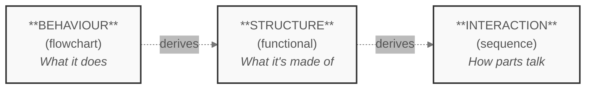
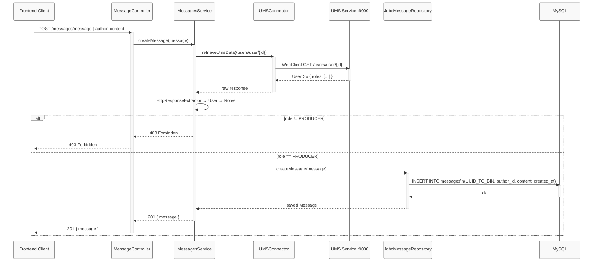

# Drawing the Blueprint: Flowchart, Functional Diagram, and Sequence Diagram

# Lesson 3 of _Build a Twitter Clone_ - A Practical Guide to Software Modelling

In [Lesson 2](https://dev.to/eugene-zimin/the-blueprint-beneath-the-blueprint-designing-data-model-and-choosing-its-database-3bhl), we defined what `Bird` must _remember_: two databases, tables within, every field traced back to a use case. Now it's time to draw what `Bird` must _do_. Using `"Post a message"` as our single worked example, we construct all three diagrams in sequence - first a flowchart that traces the user action step by step, then a functional diagram that reads the required components directly off that flowchart, then a sequence diagram that shows exactly how those components talk. By the end, the use case that started as a sentence on a sticky note has a complete, traceable blueprint.

## Introduction - The Foundation Is Ready

Lesson 2 ended with a promise, and it's worth quoting precisely:

> _"That's where Lesson 3 picks up: with the data model as the foundation, we draw all three diagrams."_

That moment has arrived. But it's worth pausing for a second to notice what's different now compared to where we started.

In [Lesson 1](https://dev.to/eugene-zimin/from-idea-to-blueprint-turning-a-vague-app-concept-into-something-you-can-actually-build-1a60), we introduced the idea of three diagrams - a flowchart, a functional diagram, and a sequence diagram - as three lenses on a single system. We explained the mental model, argued for the order, and left it there. No diagrams were actually drawn, and that was deliberate: a diagram drawn before the project is bounded and the data understood is a diagram you'll redraw.

![[Ready to draw.png]] Figure 1. The Foundation Is Ready

In [Lesson 2](https://dev.to/eugene-zimin/the-blueprint-beneath-the-blueprint-designing-data-model-and-choosing-its-database-3bhl), we did the bounding. We read `Bird`'s three use cases for data clues, named two entities (`User` and `Message`), defined five tables across two databases (`ums` and `twitter`), and established the relationships that tie them together. The schema is real now: a `messages` row has a specific shape - an `id`, a `content` field capped at 280 characters, an `author_id`pointing to a row in `ums.users`, and a `created_at` timestamp. The `users` row has a shape too. Every "save the message" step in every diagram we draw will refer to something concrete.

That concreteness is what changes everything. A diagram drawn on top of a real data model isn't a sketch - it's a specification. The boxes mean something. The arrows carry named fields. When a step says _"validate the message,"_ we already know what the validation is checking (which is called validation criteria): a non-empty `content` string, no longer than 280 characters, attached to an authenticated `author_id`. Nothing is left as a placeholder.

This lesson draws all three diagrams. We'll work in order - behaviour first, then the structure that behaviour implies, then the detailed conversation inside that structure - for the same reason we always work in that order: each diagram is the input to the next, and the input has to exist before the output can be correct.

## A Quick Reminder: The Three-Lens Progression

Before we pick up the pen, one short bridge back to [Lesson 1](https://dev.to/eugene-zimin/from-idea-to-blueprint-turning-a-vague-app-concept-into-something-you-can-actually-build-1a60) - not a full re-teach, just enough to make sure the scaffold is standing.

The core idea is this: any software system can be understood from three distinct angles, and each angle demands a different kind of diagram.

|Lens|The question it answers|The diagram|What you see|
|---|---|---|---|
|**Behaviour**|What should the app _do_?|Flowchart|Steps, decisions, and outcomes - the system as a _process_ unfolding in time|
|**Structure**|What _parts_ must exist to make that behaviour happen?|Functional diagram|Components and their connections - the system as a _thing made of pieces_|
|**Interaction**|How do those parts _talk_ to each other at runtime?|Sequence diagram|Messages exchanged between components - the system as a _conversation_|

None of these is more correct than the others. A flowchart can't tell you what components to build. A functional diagram can't tell you what happens when a user submits an empty message. A sequence diagram can't tell you whether you've correctly scoped the feature. They are **complementary**, not competing - and you need all three because no single one is complete.

The critical habit is the **order**. You move behaviour → structure → interaction, and each step is derived from the one before:

Figure 2. The three-lens progression - each diagram derives from the one before

The reason the order is fixed: you can't know what components to build until you know what the system must do. And you can't describe the conversation between components until you know which components exist. Behaviour is the requirement; structure serves it; interaction lives inside structure.

> **An analogy for the progression.** Imagine designing a kitchen. First you decide what the kitchen must _do_- prepare meals, store food, clean dishes. That's behaviour. Then you ask what _parts_ must exist to support each of those tasks: a cooktop, a refrigerator, a sink. That's structure, falling out of behaviour. Finally, you trace the specific workflow - the chef moves from the refrigerator to the prep surface to the cooktop, in that order, passing ingredients along. That's interaction, living inside the structure. You couldn't have designed the workflow without knowing the layout. You couldn't have designed the layout without knowing the tasks. The order is the method.

## Lens 1: Behaviour - Drawing the Flowchart

A flowchart answers one question: **what does the system do, step by step?** Not what parts it has. Not which component calls which. Just the sequence of actions and decisions that carry a user from "I want to post a message" to "it's done" - or to an error, if something goes wrong along the way.

That makes the flowchart the right place to start. It captures the requirement in its purest form, before any implementation choices have been made.

### Building it step by step

**Step 1 - Name the start and end points.**

The flow begins the moment the user presses "Post" - that is, when the system receives a submission. It ends either with a new row in `twitter.messages` and a confirmation to the user, or with an error message and no row written. Name those endpoints first, before filling in anything in between.

**Step 2 - List the actions in order.**

Walk the happy path first - what happens when everything goes right? For "Post a message," that sequence is:

1. Submit a message
2. Pass the authentication check - is the user logged in?
3. Pass the permissions check - is the user allowed to post?
4. Pass content validation - is the message valid?
5. Save the message to the database
6. Confirm success to the user

Six steps. Two are actions, three are decision gates, one is a confirmation. That's a healthy breakdown - the logic is explicit without becoming an implementation manual.

**Step 3 - Add the decision points.**

Three decision diamonds gate the happy path:

- **Is the user logged in?** If no → redirect to the login page. After a successful login the user is returned to the submission step - a loop, not a dead end.
- **Is the user allowed to post?** Not every account has posting rights - a read-only or suspended role is blocked here. If no → shared Error node → END.
- **Is the message valid?** (Non-empty? Within 280 characters?) If invalid → shared Error node → END.

Notice that the two error branches converge on a single `Error` node before reaching `END`. This is an intentional design choice in the diagram: the system's response to a permissions failure and a content failure is the same kind of thing - an error returned to the user. Merging them keeps the diagram clean and makes that equivalence visible.

**Step 4 - Connect and label.**

Arrange the steps top to bottom, connect them with arrows, and label every arrow leaving a decision diamond. The labels on the branches ("yes / no", or more descriptively "valid / invalid") are what make the diagram readable at a glance.

### The flowchart

![[flowchart - post message.drawio.png]]
Figure 3. Flowchart for "Post a message"

### What this diagram tells us - and what it doesn't

The flowchart is intentionally silent on _how_ each step is implemented. It doesn't say which component checks authentication, or what library validates the string length, or whether the database write is synchronous. Those details don't belong here. What the flowchart does - and does well - is make the **logic** visible: the decisions, the branches, the outcomes. That's the entire job of Lens 1.

Notice that the data model already sharpens the language. The "Save message" step doesn't just say _"save the message"_- it names the fields: `author_id`, `content`, `created_at`, writing into `twitter.messages`. That specificity comes directly from Lesson 2. The flowchart is still high-level, but it's no longer vague.

With the behaviour fully drawn, the next question asks itself: **what parts must exist to make each of these steps happen?** That's Lens 2 - and the answer comes directly from reading this flowchart.

## Lens 2: Structure - Reading the Functional Diagram off the Flowchart

The flowchart is done. We know what "Post a message" must do - the steps, the decisions, the branches. Now a different question takes over: **what parts must exist inside the system to make each of those steps happen?**

This is where most beginners get into trouble. They open a new diagram and start inventing components - a generic `AuthService`, an `APIGateway`, a `DatabaseLayer` - based on instinct or prior experience. The result is a diagram that reflects what the developer already knew, not what the use case actually requires.

There is a better method. The functional diagram doesn't need to be invented. It can be **read directly off the flowchart**.

### The method: scan every step, ask one question

For each step in the flowchart, ask: _what component must own this responsibility?_ The answer names a block. Do that for every step, merge the ones that belong together, and the structure falls out of the behaviour.

Let's walk through the flowchart step by step.

| Flowchart step               | Responsibility                                            | Component                                 |
| ---------------------------- | --------------------------------------------------------- | ----------------------------------------- |
| User submits message         | Sends the HTTP request                                    | **Frontend Client**                       |
| Is the user logged in?       | Identifies who is making the request                      | **Twitter Service**                       |
| Redirect to login            | Returns the login page                                    | **Frontend Client**                       |
| Is the user allowed to post? | Fetches the user record and checks for the `PRODUCER`role | **Twitter Service** → **UMS Service**     |
| Is the message valid?        | Enforces content rules (non-empty, ≤ 280 chars)           | **Twitter Service**                       |
| Save message                 | Writes the row to `twitter.messages`                      | **Twitter Service** → **MySQL Database**  |
| Confirm success              | Returns `201` with the created message                    | **Twitter Service** → **Frontend Client** |
| Return error                 | Returns `403 Forbidden` to the client                     | **Twitter Service** → **Frontend Client** |

Two things stand out immediately. First, the **Twitter Service** carries the most weight: it receives the request, performs content validation, and orchestrates the database write. But it doesn't hold user data - that lives in UMS. So for the permission check, the Twitter Service calls the **UMS Service** via an internal HTTP request, retrieves the user's roles, and decides whether to proceed. This cross-service call is the architectural heart of the feature.

Second, there is no separate `API Gateway` or `Auth Service` in `Bird`. The Frontend Client talks directly to the Twitter Service on port `9001`. Role checking is a responsibility of the Twitter Service itself, delegated to UMS on demand - not a standalone component sitting in between.

This gives us four components: the **Frontend Client**, the **Twitter Service**, the **UMS Service**, and **MySQL Database**.

### The functional diagram

![[functional diagram.drawio.png]] 
Figure 4. Functional diagram for `Bird`

The diagram reads as a set of named blocks connected by labelled arrows. The arrows carry the nature of the relationship - not the step-by-step logic (that's the flowchart's job) but the structural dependency: the Frontend Client sends requests to the Twitter Service; the Twitter Service calls UMS to validate the user; the Twitter Service reads and writes MySQL directly. Each arrow represents a real, named communication channel in the codebase - HTTP on `:9001` for the UI-to-service call, `WebClient` for the service-to-service call, JDBC for the database connection.

### What this diagram is - and isn't

A functional diagram is a **map of components**, not a map of steps. It answers "what pieces exist and how are they connected?" - not "what happens first?" The flowchart and the functional diagram are not redundant; they answer different questions and each is incomplete without the other.

Notice also what the functional diagram deliberately omits: there are no arrows labelled with field names, no decision branches, no error paths, no sequence numbers. Those details live in the sequence diagram. Here, the goal is structural clarity - a reader should be able to see at a glance what `Bird` is made of and how the pieces relate.

With the components named and connected, one question remains: **how exactly do they talk to each other during "Post a message"?** That's the sequence diagram - and now that we know which components exist, we can finally draw it precisely.

## Lens 3: Interaction - The Sequence Diagram

The flowchart told us _what_ "Post a message" does. The functional diagram told us _what components_ exist to do it. The sequence diagram answers the last question: **what do those components say to each other, in what order, when the feature actually runs?**

This is where the previous two diagrams earn their investment. Every component named in the functional diagram becomes a lifeline. Every step in the flowchart becomes a message on one of those lifelines. Nothing is invented - it's assembled from what we already know.

### From components to lifelines

A sequence diagram is built around **lifelines** - vertical columns, one per component, representing each participant in the interaction. Reading the functional diagram directly, our lifelines are:

- **Frontend Client** - the browser, initiating the request
- **MessageController** - the entry point inside the Twitter Service, receiving the HTTP call
- **MessagesService** - the orchestrator: calls UMS, checks roles, triggers the database write
- **UMSConnector** - the thin HTTP client that talks to UMS via `WebClient`
- **UMS Service** - the external service that owns user identity and roles
- **JdbcMessageRepository** - the DAO that executes the SQL insert
- **MySQL** - the database that persists the row

### Reading the flow

The messages between lifelines follow the exact path the codebase executes. Let's trace it:

1. The **Frontend Client** sends `POST /messages/message` with `{ author, content }` to the **MessageController**.
2. **MessageController** deserializes the body into a `Message` DTO and delegates to **MessagesService** via `createMessage(message)`.
3. **MessagesService** needs to verify the author - it doesn't hold user data, so it calls **UMSConnector** with `retrieveUmsData(/users/user/{id})`.
4. **UMSConnector** fires a non-blocking `WebClient GET` to the **UMS Service**.
5. **UMS Service** returns a `UserDto` containing the user's roles.
6. **MessagesService** unpacks the response via `HttpResponseExtractor` and inspects the `Roles`. If the user is not a `PRODUCER` - the flow terminates here with a `403 Forbidden` back to the client.
7. If the role check passes, **MessagesService** calls `createMessage(message)` on **JdbcMessageRepository**.
8. **JdbcMessageRepository** executes `INSERT INTO messages` against **MySQL** (converting the UUID via `DaoHelper`).
9. **MySQL** returns `ok`.
10. The saved `Message` travels back up: **JdbcMessageRepository** → **MessagesService** → **MessageController** → **Frontend Client** as `201 { message }`.

### The sequence diagram

Figure 5. Sequence diagram for "Post a message"

### What this diagram shows that the others couldn't

Look at the `alt` block in the middle of the diagram. That's the permission check - the same diamond in the flowchart, the same role-checking responsibility assigned to `MessagesService` in the functional diagram. But now it has an exact form: a comparison against the `PRODUCER` role, returning `403 Forbidden` if it fails, with the response passing back through `MessageController` to the client.

This is **traceability** working in practice. The validation step in the flowchart → the `MessagesService` block in the functional diagram → the `HttpResponseExtractor → User → Roles` call chain in the sequence diagram. One idea, three levels of resolution.

Notice also what the sequence diagram adds that neither previous diagram could: **the reactive chain**. The `UMSConnector`call is non-blocking - `MessagesService` issues the `WebClient` request and the rest of the chain executes inside a `.flatMap()`. The sequence diagram makes this visible through the activation boxes: `MS` stays active while `UC` and `UMS` do their work, then resumes. That concurrency detail is invisible in both the flowchart and the functional diagram.

With all three diagrams drawn, one use case - "Post a message" - now has a complete, layered blueprint. The next section puts all three side by side and shows what traceability looks like end to end.

Let's pause before moving on and do something the three diagrams individually don't do: put them side by side and trace a single idea across all of them.

Take the permission check - the moment the system decides whether the author is allowed to post. Here is where it lives in each diagram:

|Diagram|Where the permission check appears|What you can see|
|---|---|---|
|**Flowchart**|The diamond _"Is user allowed to post?"_ branching to `Error`or continuing to validation|The _logic_ - two outcomes, one decision|
|**Functional diagram**|The arrow from `MessagesService` labelled _"check roles contains PRODUCER"_ pointing to `Roles`|The _ownership_ - which component holds this responsibility|
|**Sequence diagram**|The `alt` block: `HttpResponseExtractor → User → Roles`, branching to `403 Forbidden` or `INSERT`|The _mechanics_ - what data moves, in what order, producing what result|

Same check. Three levels of resolution. You could point at the diamond in the flowchart, follow it to the `MessagesService`arrow in the functional diagram, and land on the `alt` block in the sequence diagram - and at each step you'd learn something the previous diagram couldn't tell you.

That property is **traceability**: the ability to follow a single requirement from its highest-level expression down to its lowest-level implementation without losing the thread. It's what separates a set of diagrams that decorate a document from a set that actually functions as a blueprint.

![[One Feature, Three Views - The Permission Check Traced.jpg]]Figure 6. One feature, three views - the permission check traced across all three diagrams

Notice also what traceability reveals in the other direction. The sequence diagram shows that the `403 Forbidden` response travels back through `MessageController` before reaching the client - a detail invisible in both the flowchart (which just says "Error → END") and the functional diagram (which shows `MessageController` connected to `GlobalExceptionHandler` without explaining when). The diagrams don't just repeat each other. Each one completes the picture in a direction the others leave open.

## Limitations and Open Questions

Three diagrams drawn, one use case traced. Before closing, it's worth being clear about what this process is - and what it isn't.

**Diagrams go stale.** Every diagram in this lesson reflects the codebase as it stands today. The moment a new field is added to `messages`, or the permission model changes, or `UMSConnector` is replaced by a shared auth library - the diagrams need updating. A diagram that isn't maintained becomes misleading faster than no diagram at all. The discipline of drawing diagrams is only half the work; the other half is keeping them honest.

**This is a snapshot, not a specification.** The diagrams here describe what `Bird` does, not what it must do. A specification would go further - stating invariants, error contracts, performance bounds, and edge cases. These diagrams are the foundation of a spec, not the spec itself. They answer "how does it work?" not "how must it always work?"

**Over-modelling is a real risk.** Drawing all three diagrams for every feature in a large system would consume more time than it saves. The three-lens approach is most valuable at decision points: when designing a new feature from scratch, when onboarding someone to an unfamiliar part of the system, or when debugging behaviour that contradicts the mental model. Applied indiscriminately, it becomes ceremony rather than engineering.

**These diagrams are not UML.** Readers familiar with the Unified Modelling Language (UML) will notice that the diagrams in this lesson borrow UML conventions - sequence diagram lifelines, flowchart decision diamonds - without following the full UML standard. That's deliberate. UML is precise and complete, and its precision comes at the cost of accessibility. However when you move to production systems with formal specification requirements, UML or C4 may be the right choice.

## What's Next

Three lessons in, and `Bird` has a bounded scope, a real data model, and a complete three-lens blueprint for its core feature.

What it doesn't have yet is a working API. The diagrams show that a `POST /messages/message` endpoint should exist, that it must accept `{ author, content }`, that it must call UMS before writing to the database - but none of that is running code yet.

**Lesson 4** is where the diagrams meet the wire. We'll define the API contracts and endpoints that connect `Bird`'s components - what each service exposes, what it expects, and what it returns. The sequence diagram already told us that `POST /messages/message` must exist, that it calls `GET /users/user/{id}` on UMS, and that both exchanges carry specific payloads. Lesson 4 makes those contracts explicit and formal: request shapes, response shapes, status codes, and the communication protocol between the Twitter Service and UMS.

The diagrams were never the destination. They were the clearest possible way to know what to build before building it.