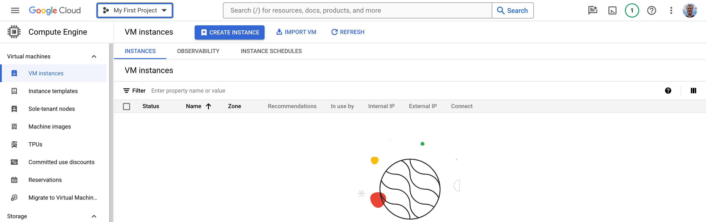

# [Google Cloud: Provisioning a Virtual Machine and Accessing it via SSH](https://medium.com/p/dde4307a8e9b)

## Introduction

Google Cloud Compute Engine is a powerful Infrastructure-as-a-Service (IaaS) offering from Google Cloud Platform (GCP) that provides scalable and flexible virtual machine instances. These instances, known as Compute Engine instances, allow you to run workloads and applications on Google's robust and secure infrastructure.

Compute Engine is designed to meet a wide range of computing needs, from small-scale projects to large-scale enterprise applications. It offers a variety of machine types, ranging from shared-core instances for basic workloads to high-performance instances with up to 416 vCPUs and 12.8 TB of memory for computationally intensive tasks.

One of the primary use cases of Compute Engine is to run and scale web applications and services. With its global network of data centers, Compute Engine instances can be deployed close to your users, ensuring low latency and high availability. It's also commonly used for batch processing, data analysis, and scientific computing tasks that require substantial computing power.

Additionally, Compute Engine integrates seamlessly with other GCP services, such as Google Cloud Storage, Cloud SQL, and Cloud Load Balancing, allowing you to build and deploy complex applications and architectures within the Google Cloud ecosystem.

In this article, we'll walk through the process of creating a single Compute Engine instance and gaining SSH access to it. This is a crucial first step in leveraging the power of Google Cloud Compute Engine, whether you're deploying a simple web server, running computational workloads, or building more sophisticated applications.

In this article, we'll walk through the process of creating a single Compute Engine instance and gaining SSH access to it. This is a crucial first step in leveraging the power of Google Cloud Compute Engine, whether you're deploying a simple web server, running computational workloads, or building more sophisticated applications.

Specifically, you'll learn how to:

1. Create a new Compute Engine instance from the Google Cloud Console, specifying key configuration options like machine type, operating system, and networking settings.
2. Connect to your newly provisioned instance securely via SSH (Secure Shell), a encrypted network protocol that allows you to remotely operate and manage the instance from your local machine.

By the end of this guide, you'll have a fully operational Compute Engine instance running on Google's cloud infrastructure, ready for you to install software, deploy applications, or run any other workloads you require. Getting hands-on experience with creating and accessing a Compute Engine instance is an essential first step in your journey with Google Cloud Platform.

Whether you're an individual developer, a system administrator, or part of an enterprise team, the ability to provision and manage compute resources on-demand is a critical skill in today's cloud-centric world. This article aims to provide a straightforward, step-by-step approach to getting started with Compute Engine, enabling you to take full advantage of Google Cloud's powerful and scalable infrastructure.
## Prerequisites

Before you can create and access a Compute Engine instance, you'll need to have a few things set up. Keep in mind - it would be free for you, just don't forget to shut down the instance when you no longer need it.
#### Google Cloud account
To get started with Google Cloud Compute Engine, you'll need a Google Cloud account. If you don't have one already, you can easily create a new account by visiting the [Google Cloud website](https://cloud.google.com/)) and clicking on the "Get Started for Free" button.

The sign-up process will prompt you to create or sign in with a Google Account (Gmail account) and provide some basic information, such as your name and billing details. Don't worry, Google offers a generous free trial with $300 in free credits to explore their services, including Compute Engine.
#### Enabled Compute Engine API
Once you have a Google Cloud account, you'll need to enable the Compute Engine API for your project. This API provides the necessary backend services for creating, managing, and interacting with Compute Engine instances.

To enable the Compute Engine API, follow these steps:

- Log in to the Google Cloud Console ([https://console.cloud.google.com](https://console.cloud.google.com/))
- Navigate to the "APIs & Services" section
- Click on "Library" and search for "Compute Engine API"
- Click "Enable" to activate the API for your project

With your Google Cloud account set up and the Compute Engine API enabled, you're now ready to proceed with creating your first Compute Engine instance.

In the next section, we'll walk through the step-by-step process of provisioning a new instance from the Google Cloud Console.

#### Install Google Cloud SDK (optional)
While you can create and manage Compute Engine instances directly through the web-based Google Cloud Console, it's often more convenient and efficient to use the Google Cloud SDK (Software Development Kit) from your local machine. The Cloud SDK provides a command-line interface and a set of tools for interacting with Google Cloud services, including Compute Engine.

To install the Google Cloud SDK, follow the instructions for your operating system:
- [Windows installation guide](https://cloud.google.com/sdk/docs/install#windows)
- [macOS installation guide](https://cloud.google.com/sdk/docs/install#mac)
- [Linux installation guide](https://cloud.google.com/sdk/docs/install#linux)

The installation process is straightforward and involves downloading the SDK package, running the installer, and optionally adding the SDK to your system's PATH variable for easier access to the `gcloud` command-line tool.

After installing the Cloud SDK, you'll need to initialize it and authenticate with your Google Cloud account. You can do this by running the following command in your terminal or command prompt:

```
gcloud init
```

This will prompt you to sign in with your Google Account and select the appropriate project and default compute region for your Compute Engine instances.

Having the Google Cloud SDK installed and configured on your local machine will make it much easier to manage your Compute Engine instances using commands like `gcloud compute instances create`, `gcloud compute ssh`, and more. We'll cover some of these commands in later sections of this article.

With the Google Cloud SDK installed and authenticated, you're now fully prepared to create and interact with Compute Engine instances from your local development environment or operations workstation.

## Step 1: Creating a Compute Engine Instance

With the prerequisites out of the way, it's time to dive into the process of creating your first Compute Engine instance. You can do this either through the web-based Google Cloud Console or using the `gcloud` command-line tool provided by the Google Cloud SDK.

In this section, we'll walk through the process of creating an instance from the Cloud Console, as it provides a user-friendly interface for configuring various instance settings.

#### Log in to the Google Cloud Console

Open your web browser and navigate to the [Google Cloud Console](https://console.cloud.google.com/)). Log in with your Google Cloud account credentials and click to Console.

#### Navigate to the Compute Engine section

From the Cloud Console dashboard, navigate to the Compute Engine section and click on "Create a VM". You can find it under the "Products" section below or in under the "Computing" heading in the navigation menu on the left-hand side.

After you clicked "Create a VM" you will be directed to start the process of creating a new virtual machine instance you will going to use.


#### Confirm your credential

At this point Google Cloud will ask you to set up your account and confirm your credentials if you haven't done that already. Please do that and after you confirm your identity and get your account set up, you will be able to create a new project for instance.


#### Create a project

This step is necessary to group your different projects under appropriate groups. 


Click on the button "Create Project" and you will be redirected into the page where you will be invited to create a new project in Compute Engine.


You might be redirected into another page, asking you to enable Compute Engine API, if it is not enabled before. If that is true, you need to click "Enable" to allow Compute Engine enables access to Cloud API.


When Compute Engine API will be enabled you will be redirected to the page where you can click "Create instance" button and system will ask you to fill out necessary details.



#### Configure instance details

The "Create a VM" dialog will prompt you to configure various settings for your new instance.  Observe them carefully and fill out in a way they highlighted. It would be enough to play with Kubernetes instance - microk8s.


Scrolling down, don't forget to click on the `CHANGE` button to change the size of the boot disk. By default it is set to 10Gb only which is definitely not enough for Kubernetes instance. I prefer to set it as a minimum to 100Gb.


Rest parameters allow your instance to get access to the Cloud API and incoming HTTP(-s) traffic - which may be necessary on next steps, when you deploy your applications and would like them to be reachable.
#### Click "Create" to provision the instance

Once you've reviewed and configured all the necessary settings, click the "Create" button at the bottom of the dialog. Google Cloud will now provision your new Compute Engine instance based on the specified configuration.

Depending on the machine type and operating system you selected, it may take a few minutes for the instance to be fully provisioned and ready for use.

After completing this step, you'll have a running Compute Engine instance in your Google Cloud project. However, to interact with the instance and perform administrative tasks, you'll need to establish an SSH connection, which we'll cover in the next section.

## Step 2: Connect to the Instance via SSH

Now that you've successfully created a Compute Engine instance, the next step is to establish a secure connection to it using SSH (Secure Shell). SSH allows you to access and manage your instance remotely from your local machine using an encrypted communication channel.

There are several methods you can use to connect to your Compute Engine instance via SSH. Let's explore the different options.

#### Browser-based SSH
The Google Cloud Console provides a built-in SSH client that runs directly in your web browser. This method is convenient if you don't have the Google Cloud SDK installed or if you're accessing your instance from a machine where you can't install additional software.

To use the browser-based SSH client, follow these steps:

- In the Compute Engine section of the Cloud Console, locate your instance and click on its name

- On the instance details page, click the "SSH" button at the top


- A new window or tab will open, presenting you with a web-based terminal connected to your instance via SSH.

While the browser-based SSH client is handy for quick access and basic tasks, it may have limitations in terms of functionality and customization compared to other methods.

#### Google Cloud SDK
As discussed in the prerequisites section, the [Google Cloud SDK](https://cloud.google.com/sdk/docs/install) provides a powerful command-line interface (CLI) for interacting with Google Cloud services, including Compute Engine. One of the key features of the Cloud SDK is the ability to establish SSH connections to your instances directly from your local terminal.

You need to install it before using, following installation instructions from here: [Install the gcloud CLI](https://cloud.google.com/sdk/docs/install)

To connect to your instance using the Cloud SDK, follow these steps:
- Open a terminal or command prompt on your local machine.
- Run the following command, replacing `[INSTANCE_NAME]` with the name of your Compute Engine instance:
```
gcloud compute ssh [INSTANCE_NAME] --zone=[INSTANCE_ZONE]
```

- If prompted, accept the security warning and allow the connection.
The `gcloud compute ssh` command automatically handles the SSH key management and authentication process, making it a convenient and secure way to connect to your instances.

#### Third-party SSH clients
If you prefer using a dedicated SSH client application, you can also connect to your Compute Engine instance using third-party tools like PuTTY (Windows), Terminal (macOS), or any other SSH client of your choice.

To connect using a third-party client, you'll need to obtain the external IP address of your instance and configure the appropriate SSH keys or credentials. You can find the external IP address in the instance details page of the Cloud Console.

Next step - you need to add your SSH public key to your VM instance. To do so, go to your Compute Engine and click on "VM Instances", then choose your VM, click on it and then choose "EDIT" button.


Scroll down to the section, called "Security and access" and find there "+ADD ITEM" button. You need to click on it to add your own public key which will be used for your authentication procedure.

Usually your own keys are stored in `.ssh/` folder. If they're not there you need to generate one with following command - `ssh-keygen -t ed25519 -C "google-compute-engine"`, which will create you a new key in ED25519 format and store it in `.ssh/` folder. Copy the context of the `.ssh/id_ed25519.pub` file and paste it as a the new SSH key.


Adding a key you also need to specify your email, after the key itself, which you use to access the GCE account. So final string you should put there will look like this
```
ssh-ed25519 AAAAB3NzaC1yc2EAAAADAQABAAABAGPgFnr6K2+uJeWI/me4ciGXh5cc1vAg3Jf2dsIPZiY1u your@email.com
```

Save it and now it's time to try it out! Then, use your preferred SSH client to initiate a connection to the external IP address, providing the appropriate SSH keys or credentials when prompted - in your terminal try to connect and don't forget to specify the security key you used  with option `-i <path to your private key>`.

## Step 3: Verify SSH Connection and Instance Details

After establishing an SSH connection to your Compute Engine instance, it's a good idea to verify that the connection was successful and familiarize yourself with some basic commands to check the instance details.

#### Verify Successful SSH Connection
Once you're logged in to your instance via SSH, you can run a few simple commands to confirm that the connection is active and working correctly:

Check the hostname:
```
hostname
```
This should display the hostname of your Compute Engine instance.

Check the IP address:
```
hostname -I
```
This command will show the IP address(es) associated with your instance.

#### Check Instance Details

The Google Cloud SDK provides several helpful commands to retrieve information about your Compute Engine instance, such as its name, machine type, zone, and other metadata. Here are a few examples:

Get instance name and zone:
```
gcloud compute instances describe [INSTANCE_NAME] --zone=[INSTANCE_ZONE] --format='get(name,zone)'
```
This command will display the instance name and the zone it's located in.

Get machine type:
```
gcloud compute instances describe [INSTANCE_NAME] --zone=[INSTANCE_ZONE] --format='get(machineType)'
```
This will show the machine type (e.g., `n1-standard-1`, `e2-highcpu-8`, etc.) of your instance.

Get external IP address:
```
gcloud compute instances describe [INSTANCE_NAME] --zone=[INSTANCE_ZONE] --format='get(networkInterfaces[0].accessConfigs[0].natIP)'
```
This command will retrieve the external IP address assigned to your instance, which is useful for accessing it from the internet.

Get operating system details:
```
gcloud compute instances describe [INSTANCE_NAME] --zone=[INSTANCE_ZONE] --format='get(disks[0].licenses)'
```
This will display the operating system license associated with your instance's boot disk, indicating the operating system type (e.g., `ubuntu-2004-focal` for Ubuntu 20.04).

By running these commands, you can verify that your SSH connection is working correctly and gather essential information about your Compute Engine instance, such as its name, zone, machine type, IP address, and operating system. This information can be helpful for managing and troubleshooting your instance, as well as for integrating it with other services or applications in your Google Cloud environment.

Feel free to explore additional `gcloud compute` commands to retrieve more detailed information about your instance, such as its metadata, attached disks, network configurations, and more.

## Conclusion

In this article, we've covered the essential steps to get started with Google Cloud Compute Engine by creating a single instance and establishing an SSH connection to it. Let's quickly recap what we've learned:

1. **Set up Prerequisites**: We ensured that you have a Google Cloud account, enabled the Compute Engine API, and installed the Google Cloud SDK on your local machine.

2. **Create a Compute Engine Instance**: Using the Google Cloud Console, we walked through the process of creating a new Compute Engine instance, configuring its settings such as machine type, boot disk, and networking options like allowing HTTP/HTTPS traffic.

3. **Connect via SSH**: We explored different methods to connect to the instance securely via SSH, including the browser-based SSH client, the `gcloud compute ssh` command from the Google Cloud SDK, and the option to use third-party SSH client applications.

4. **Verify Connection and Instance Details**: Finally, we covered some useful commands to verify the successful SSH connection and retrieve important instance details like its name, zone, machine type, IP address, and operating system.

By completing these steps, you now have a fully operational Compute Engine instance running on Google's cloud infrastructure, ready for you to install software, deploy applications, or run any other workloads you require.

To continue learning and leveraging the full potential of Google Cloud Compute Engine, be sure to explore the extensive documentation and resources provided by Google Cloud:

- [Google Cloud Compute Engine Documentation](https://cloud.google.com/compute/docs)
- [Google Cloud Compute Engine Tutorials](https://cloud.google.com/compute/docs/tutorials)
- [Google Cloud Compute Engine Pricing Calculator](https://cloud.google.com/products/calculator)
- [Google Cloud Compute Engine Quotas and Limits](https://cloud.google.com/compute/quotas)

With the knowledge and skills you've gained from this article, you're now well-equipped to start building and deploying your applications and workloads on Google's robust and scalable cloud infrastructure.
